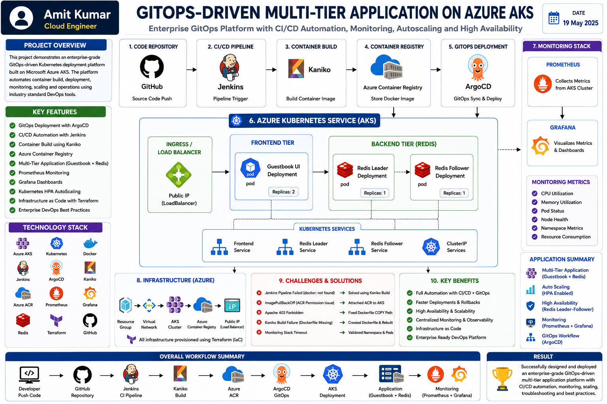

# 🚀 Enterprise GitOps-Driven Multi-Tier Application Platform on Azure AKS


Enterprise-grade cloud native Kubernetes deployment platform implementing GitOps workflows, CI/CD automation, infrastructure automation, monitoring, scaling, and operational observability on Microsoft Azure.

---

## 📌 Project Overview

This project demonstrates a production-style enterprise Kubernetes deployment ecosystem built on Microsoft Azure using GitOps principles.

The platform automates application delivery workflows, container image management, monitoring, deployment recovery, infrastructure provisioning, and Kubernetes operational management while following enterprise DevOps practices.

The implementation simulates real-world cloud engineering operations commonly used across enterprise environments.

---

## 🧑‍💼 Business Requirement

The objective was to design a deployment ecosystem capable of:

✅ Eliminating manual deployments

✅ Automating application delivery

✅ Supporting Kubernetes workloads

✅ Providing deployment visibility

✅ Enabling infrastructure scalability

✅ Implementing GitOps deployment strategy

✅ Supporting monitoring & observability

✅ Reducing operational effort

---

## 🏗 Enterprise Deployment Architecture



Deployment Workflow:

Developer Push Code

↓

GitHub Repository

↓

Jenkins Pipeline Trigger

↓

Kaniko Image Build

↓

Azure Container Registry

↓

ArgoCD GitOps Synchronization

↓

Azure Kubernetes Service

↓

Guestbook Frontend

↓

Redis Backend

↓

Prometheus Metrics Collection

↓

Grafana Dashboard

---

## ⚙ Technology Stack

| Technology | Purpose |
|------------|----------|
| Azure AKS | Kubernetes Platform |
| Azure Container Registry | Container Registry |
| Jenkins | CI/CD Automation |
| Kaniko | Container Build |
| ArgoCD | GitOps Deployment |
| Terraform | Infrastructure Automation |
| Kubernetes | Container Orchestration |
| Docker | Containerization |
| Redis | Application Backend |
| Grafana | Monitoring Dashboard |
| Prometheus | Metrics Collection |
| Linux | System Administration |
| GitHub | Source Control |

---

## 🔥 Enterprise Features

✅ GitOps Deployment Workflow

✅ CI/CD Automation

✅ Infrastructure Automation

✅ Kubernetes Administration

✅ Monitoring Stack

✅ Horizontal Pod Autoscaler

✅ Namespace Isolation

✅ RBAC Security

✅ Automated Delivery Pipeline

✅ Deployment Recovery

✅ Container Registry Integration

---

## 📂 Repository Structure

```

gitops-driven-multi-tier-app/

│

├── terraform/

├── kubernetes/

├── monitoring/

├── argocd/

├── jenkins/

├── images/

│ ├── 01-project-overview.png

│ ├── 02-argocd-applications.png

│ ├── 03-argocd-sync-status.png

│ ├── 05-grafana-cluster-monitoring.png

│ ├── 07-grafana-dashboard.png

│ ├── 08-guestbook-message-submit.png

│ ├── 09-guestbook-application.png

│ └── 10-jenkins-cicd-pipeline.png

│

└── README.md

```

---

## 🛠 Implementation Process

### 1️⃣ Azure Infrastructure Provisioning

Created Azure resources:

- Azure Kubernetes Service
- Azure Container Registry
- Management VM
- Load Balancer

Infrastructure provisioning automated using Terraform.

---

### 2️⃣ CI/CD Pipeline Setup

Implemented Jenkins delivery workflow:

Repository Clone

↓

Container Build

↓

Image Tagging

↓

Registry Push

↓

Deployment Trigger

Pipeline Outcome:

Automated container delivery process.

---

### 3️⃣ GitOps Deployment Implementation

Configured:

- ArgoCD
- Desired State Management
- Automated Synchronization
- Deployment Recovery

Git maintained as deployment source of truth.

---

### 4️⃣ Monitoring & Observability

Installed:

Prometheus

Grafana

Metrics Visibility:

- CPU Utilization
- Memory Consumption
- Namespace Visibility
- Node Capacity
- Pod Resource Allocation

---

## ⚠ Engineering Challenges Solved

### Challenge 01

Problem:

Container pipeline failed.

Error:

docker: not found

Root Cause:

Docker daemon unavailable inside Jenkins Kubernetes Agent.

Solution:

Implemented Kaniko image build.

Outcome:

CI/CD delivery restored.

---

### Challenge 02

Problem:

ImagePullBackOff

Root Cause:

AKS lacked Container Registry permissions.

Solution:

Integrated Azure Container Registry with AKS.

Outcome:

Deployment restored.

---

### Challenge 03

Problem:

Apache 403 Forbidden

Root Cause:

Incorrect Docker COPY configuration.

Solution:

Optimized Dockerfile.

Outcome:

Application accessible.

---

### Challenge 04

Problem:

Monitoring installation timeout.

Root Cause:

Monitoring stack initialization delay.

Solution:

Validated namespace resources.

Outcome:

Monitoring operational.

---

### Enterprise Architecture


---

## 📈 Platform Capabilities

| Capability | Status |
|------------|---------|
| CI/CD Automation | ✅ |
| GitOps Deployment | ✅ |
| Infrastructure Automation | ✅ |
| Monitoring | ✅ |
| Auto Scaling | ✅ |
| Kubernetes Operations | ✅ |
| Deployment Recovery | ✅ |
| RBAC Security | ✅ |

---

## 🛡 Security Controls

Implemented:

- RBAC
- Namespace Isolation
- Registry Authentication

Future Improvements:

- Azure Key Vault
- Secret Management
- TLS Encryption
- Trivy Scan
- OPA Policies

---

## 🧑‍💼 Business Impact

Reduced:

- Manual deployment effort
- Infrastructure drift
- Human operational errors
- Recovery time

Improved:

- Deployment reliability
- Platform visibility
- Operational consistency
- Infrastructure governance

---

## 🧠 Skills Demonstrated

Azure Cloud Administration

Terraform

GitOps

Kubernetes Administration

CI/CD Engineering

Infrastructure Automation

Cloud Native Operations

Monitoring & Observability

Containerization

DevOps Operations

Cloud Engineering

Troubleshooting

---

## 📈 Final Outcome

Successfully designed and implemented an enterprise-grade GitOps Kubernetes deployment ecosystem on Azure supporting automation, monitoring, infrastructure provisioning, deployment recovery, and cloud-native operational practices.

---

## 👨‍💻 Author

Amit Kumar

Azure Administrator | DevOps Enthusiast | Cloud Infrastructure Engineer

Passionate about building scalable cloud infrastructure, Kubernetes platforms, GitOps workflows, CI/CD automation, and enterprise cloud-native systems.

---

## 🔗 Connect With Me

LinkedIn

https://www.linkedin.com/in/amit-kumar-657255232/

GitHub

https://github.com/Akamitt009

---

⭐ If you found this project valuable, consider giving it a star.
